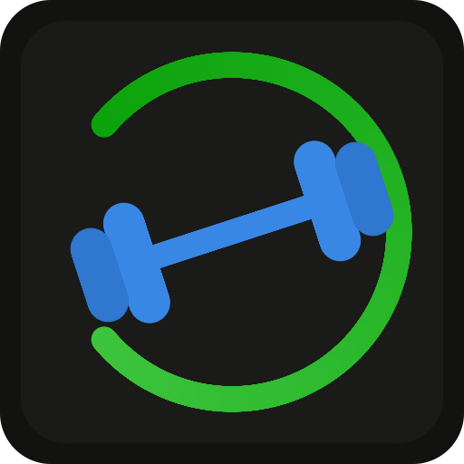

# GoFitness — Home Assistant add-on

A local-first, gamified weight-loss and meal-prep coach for the whole household,
running entirely inside Home Assistant. It gives each person a sustainable daily
calorie target, plans a real week of meals with an aggregated shopping list,
tracks weight and food, and turns the whole thing into a game with levels,
streaks and badges — all without a cloud account.

> The single most important goal is a **healthy BMI, reached sustainably** — no
> crash diets. Every calorie number is clamped by safety floors, and the plans
> lean on exercise and real food.

<p align="center">
  
</p>

## Features

- **Setup wizard** on first visit — sex, height, weight, goal and breastfeeding
  status produce a daily calorie target straight away.
- **Female and male calorie targets** (Mifflin–St Jeor) with conservative safety
  floors — never below your BMR, never below 1500 kcal (f) / 1800 kcal (m).
- **Breastfeeding-safe mode** — raises the floor, adds the DGE lactation
  surcharge (+250 / +500 kcal) and caps the deficit at 300 kcal/day. Every recipe
  is flagged breastfeeding-safe or not.
- **43 real recipes** (German + English) with ingredient lists and a durable
  recipe link, honouring this household's constraints: **little fish and only
  breaded**, and **little veg**.
- **Weekly household meal planner** with an aggregated shopping list and "cook
  once, eat twice" leftovers, so a whole week can be shopped for at once.
- **Food logging** — planned meals log exactly; ad-hoc food (ice cream, a
  Brötchen, …) is estimated by a built-in offline food table or, with an
  Anthropic API key, by Claude — including **photo recognition** that asks you to
  confirm before logging.
- **Per-person weight tracking** tied to your Home Assistant login via ingress —
  no separate accounts.
- **Gamification** — XP, 100 levels, daily and weigh-in streaks, 28 badges and a
  milestone track toward a healthy BMI.
- **Home Assistant integration** — publishes weight, BMI, calorie target and
  streak back as sensors, and can import steps from an existing tracker sensor.
- **German and English** everywhere (German primary), switchable per person.
- **Local-first** — one SQLite file under `/data`, no telemetry.

## Installation

1. In Home Assistant: **Settings → Add-ons → Add-on Store**.
2. **⋮** (top right) → **Repositories**.
3. Add `https://github.com/marvin-w/gofitness-homeassistant`.
4. Install **GoFitness** from the store, **Start** it, then **Open Web UI**.

See [gofitness/DOCS.md](gofitness/DOCS.md) for the full option reference (this is
also the text shown on the add-on's Documentation tab).

## Configuration at a glance

| Option              | Default          | Meaning                                            |
| ------------------- | ---------------- | -------------------------------------------------- |
| `anthropic_api_key` | *(empty)*        | Enables AI + photo calorie estimation. Optional.   |
| `ai_model`          | `claude-opus-5`  | Claude model used for estimates.                   |
| `default_language`  | `de`             | Language new profiles start in (`de` / `en`).      |
| `publish_sensors`   | `true`           | Mirror weight/BMI/calories/streak into HA.         |
| `log_level`         | `info`           | `debug` / `info` / `warn` / `error`.               |

Without an API key the add-on is fully functional: ad-hoc food is estimated from
a built-in offline table (~85 common foods, DE/EN) and the photo button is
hidden.

## Development

The add-on is a single pure-Go binary (module in [`gofitness/`](gofitness/)) with
an embedded vanilla-JS frontend and a CGO-free SQLite driver, so it
cross-compiles for every Home Assistant architecture.

```bash
cd gofitness
go build ./... && go vet ./... && go test ./...

# Run locally against a throwaway data dir, no add-on options file:
GOFITNESS_DATA_DIR=/tmp/gf GOFITNESS_OPTIONS=/dev/null go run ./cmd/gofitness
# then open http://localhost:8099
```

`GOFITNESS_*` environment variables override the add-on options for local runs
(`GOFITNESS_PORT`, `GOFITNESS_DATA_DIR`, `ANTHROPIC_API_KEY`, `GOFITNESS_LANG`,
`GOFITNESS_LOG_LEVEL`, `GOFITNESS_AI_MODEL`).

The design, data model, calorie formulas (with sources), API reference and
guides for adding a recipe or a translation are in
[ARCHITECTURE.md](ARCHITECTURE.md).

## Repository layout

```
.
├── repository.yaml         # Home Assistant add-on repository metadata
├── README.md               # this file
├── ARCHITECTURE.md         # design, data model, formulas, API, how-tos
├── LICENSE                 # MIT
├── .github/workflows/      # CI: Go build/vet/test, add-on lint, Docker build
└── gofitness/              # the add-on itself
    ├── config.yaml         # add-on manifest (ingress on 8099)
    ├── build.yaml          # HA base images per architecture
    ├── Dockerfile          # multi-stage, CGO-free cross-compile
    ├── run.sh              # entrypoint
    ├── DOCS.md             # in-store documentation
    ├── CHANGELOG.md
    ├── icon.png / logo.png
    ├── cmd/gofitness/      # entrypoint
    ├── internal/           # nutrition, store, recipes, mealplan, gamify, ai, hass, api, config
    └── web/                # embedded single-page frontend
```

## License

MIT — see [LICENSE](LICENSE).
